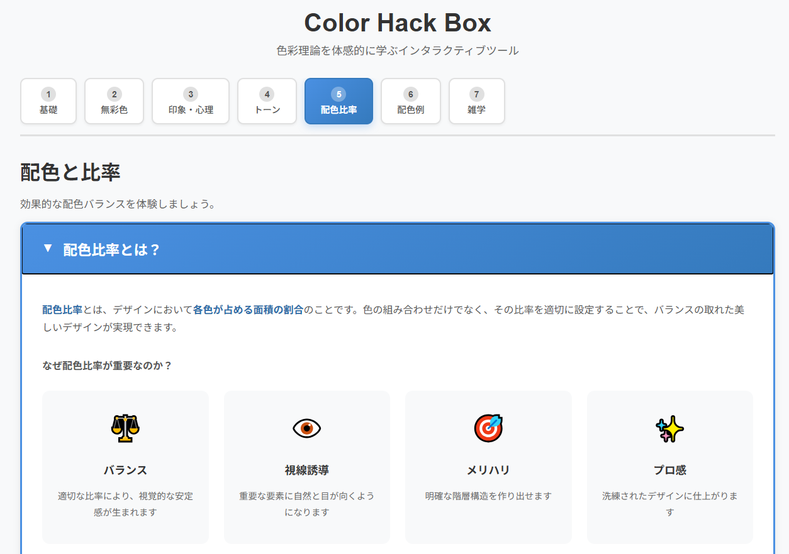

<!--
---
title: Color Hack Box
category: web, educational, color-theory
difficulty: 1
description: "Interactive web tool for exploring color fundamentals through HSL manipulation — learn about hue, saturation, and lightness with real-time visual feedback and color code conversion."
tags: [color, hsl, rgb, hex, color-theory, web, javascript, educational]
demo: https://ipusiron.github.io/color-hack-box/
---
!-->

# Color Hack Box – 色の三要素を体感する学習ツール


[](https://ipusiron.github.io/color-hack-box/)

**Day101 - 生成AIで作るセキュリティツール200**

**Color Hack Box** は、色の三要素（色相・明度・彩度）をインタラクティブに操作しながら学べる教育ツールです。

スライダーを動かすだけで、HSL（色相・彩度・明度）が色の見え方にどのように影響するかを直感的に理解できます。

HEX・RGB・HSL形式でのカラーコード表示により、デザイン実務にも活用できます。

## 🌐 デモページ

👉 **[https://ipusiron.github.io/color-hack-box/](https://ipusiron.github.io/color-hack-box/)**

ブラウザーで直接お試しいただけます。

---

## 📸 スクリーンショット

>
>*ダミー*

---

## 🎯 目的

以下の目的で開発しています。

- **色彩の基礎教育**: 色相・明度・彩度の関係を視覚的に理解
- **直感的な学習体験**: スライダー操作による即座のフィードバック
- **実務への応用**: HEX/RGB/HSL形式での色指定方法を習得
- **デザイン補助**: 配色検討時のクイックリファレンスとして活用

---

## 👥 対象ユーザー

- **デザイン初学者**: 色彩理論の基礎を学びたい方
- **Web開発者**: カラーコードの仕組みを理解したい方
- **デザイナー**: 配色検討の際のリファレンスツールとして
- **教育者**: 色彩教育の教材として活用したい方

---

## 📚 活用事例

### 1. デザイン教育での色彩理論指導
専門学校やデザインスクールにおいて、色の三要素を教える際の実習教材として活用できます。
従来の教科書による説明だけでなく、スライダーを操作することで、色相・明度・彩度の変化が色の印象にどう影響するかを体感的に理解できます。
特に「彩度を0にすると無彩色になる」「明度を変えると同じ色相でも全く違う印象になる」といった概念を、視覚的に即座に確認できる点が教育効果を高めます。

### 2. Webサイト・アプリUI設計での配色検討
Webデザイナーやフロントエンド開発者が、サイトやアプリの配色を決める際のリファレンスツールとして使用できます。
例えば、ブランドカラーをベースに、明度や彩度を調整して派生色を作成したり、補色関係を確認したりする作業をスムーズに行えます。
HEX・RGB・HSL形式でカラーコードが表示されるため、そのままCSSやデザインツールに転用できる実用性も備えています。

### 3. アクセシビリティ検証のための色調整
WCAGガイドラインに準拠したWebサイト制作において、テキストと背景のコントラスト比を確保する際に活用できます。
明度スライダーを調整することで、視認性の高い配色を探索し、高齢者や視覚障害者にも読みやすいデザインを検討できます。
また、彩度を下げた状態での見え方を確認することで、色覚多様性（色弱・色盲）への配慮も可能になります。

---

## 📁 ディレクトリー構成

```
color-hack-box/
├── index.html          # メインHTMLファイル（UI構造）
├── script.js           # JavaScript（色変換ロジック、イベント処理）
├── style.css           # スタイルシート（レイアウト、レスポンシブ対応）
├── assets/             # 画像などのリソース（スクリーンショットなど）
├── LICENSE             # MITライセンス
├── README.md           # このファイル
└── .nojekyll           # GitHub Pages設定
```

## 🎨 機能

### 基本機能
- **色相 (Hue)**: 0〜360°の範囲で色の種類を調整
- **明度 (Lightness)**: 0〜100%の範囲で明るさを調整（0%=黒、100%=白）
- **彩度 (Saturation)**: 0〜100%の範囲で鮮やかさを調整（0%=グレー、100%=純色）

### カラーコード表示
- **HEX形式**: Webで最も一般的な16進数表記（例: #FF5733）
- **RGB形式**: Red/Green/Blue値（例: rgb(255, 87, 51)）
- **HSL形式**: Hue/Saturation/Lightness値（例: hsl(12°, 100%, 60%)）

### 便利機能
- **ランダム生成**: ワンクリックでランダムな色を生成
- **リセット**: 初期値（H:0°, S:50%, L:50%）に戻す
- **色の三属性説明**: 詳細な説明をアコーディオンで表示

### 技術仕様
- **色変換アルゴリズム**: HSL→RGB変換を実装（script.js:76）
- **レスポンシブデザイン**: モバイル・タブレット・デスクトップ対応
- **依存関係なし**: 純粋なHTML/CSS/JavaScriptで動作

## 🚀 使い方

### セットアップ

依存関係やビルドツールは不要です。最新のWebブラウザーがあればすぐに使えます。

1. **リポジトリをクローン**:
```bash
git clone https://github.com/ipusiron/color-hack-box.git
cd color-hack-box
```

2. **ブラウザーで開く**:
```bash
# macOS
open index.html

# Linux
xdg-open index.html

# Windows
start index.html
```

または、ローカルサーバーで起動:
```bash
# Python 3の場合
python -m http.server 8000

# Node.js（http-serverがインストール済みの場合）
npx http-server
```

その後、`http://localhost:8000` にアクセス

### 基本的な使い方

1. **スライダーを調整**: Hue（色相）、Lightness（明度）、Saturation（彩度）のスライダーを動かす
2. **色を確認**: カラーチップでリアルタイムに色の変化を確認
3. **コードを取得**: HEX/RGB/HSL形式のカラーコードをコピーして使用
4. **ランダム生成**: 「ランダム生成」ボタンで新しい色を探索
5. **リセット**: 「リセット」ボタンで初期状態に戻す
6. **学習**: 「色の三属性とは？」を展開して色彩理論を学ぶ

---


## 📄 ライセンス

MIT License – 詳細は [LICENSE](LICENSE) を参照してください。

---

## 🛠️ このツールについて

本ツールは、「生成AIで作るセキュリティツール100」プロジェクトの一環として開発されました。
このプロジェクトでは、AIの支援を活用しながら、セキュリティに関連するさまざまなツールを100日間にわたり制作・公開していく取り組みを行っています。

プロジェクトの詳細や他のツールについては、以下のページをご覧ください。

🔗 [https://akademeia.info/?page_id=44607](https://akademeia.info/?page_id=44607)
